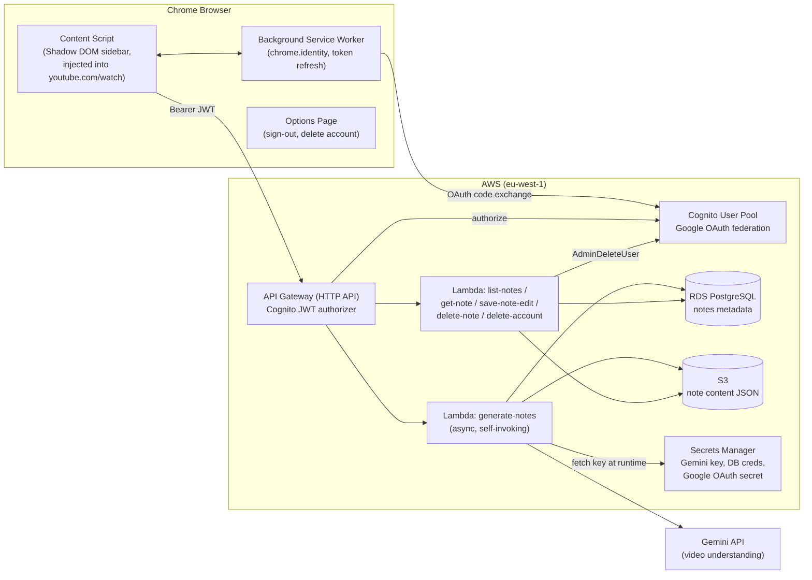
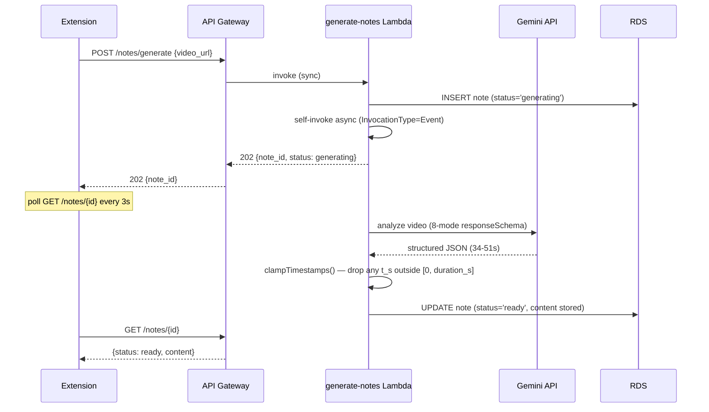
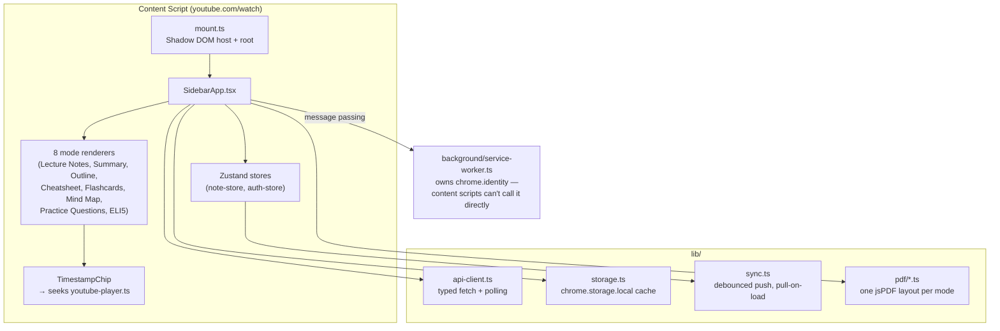

# NoteSnap

NoteSnap is a Chrome extension that turns any YouTube video into structured, editable study notes — one click, no manual note-taking. It uses Gemini's native video-understanding API to watch the video and generate content across 8 different study modes (Lecture Notes, Summary, Outline, Cheatsheet, Flashcards, Mind Map, Practice Questions, ELI5), all timestamp-linked back to the exact moment in the video.

The extension is backed by a fully serverless AWS stack for auth, storage, and generation — there is no separate backend server to run.

```
extension/   Chrome extension (Manifest V3, React, TypeScript, Vite)
infra/       AWS backend (CDK, TypeScript) — API Gateway, Lambda, RDS, S3, Cognito
docs/        Architecture, specs, pricing, and product documentation
```

## Contents

- [How it works](#how-it-works)
- [Architecture](#architecture)
- [Repository layout](#repository-layout)
- [Getting started](#getting-started)
- [Documentation index](#documentation-index)
- [Security notes](#security-notes)

## How it works

1. You open a YouTube video and sign in to NoteSnap with your Google account (via Cognito).
2. Click **Generate Notes**. The extension sends the video URL to the backend.
3. A Lambda function calls Gemini's video-understanding API, which watches the video directly (no transcript scraping) and returns structured JSON matching a strict schema — one object per study mode, with timestamps on every claim.
4. Notes are saved to Postgres (metadata) and S3 (content), then streamed back to the extension's sidebar, rendered as 8 tabbed views injected directly into the YouTube page via a Shadow DOM sidebar.
5. Every timestamp in every mode is a clickable chip that seeks the embedded YouTube player to that exact second.
6. Edits sync back to the cloud automatically (local-first, debounced), and past notes are browsable from a "My Notes" library in the sidebar.

## Architecture

### System overview



### Async note generation

API Gateway HTTP APIs hard-cap Lambda integration timeout at 29 seconds, but a full 8-mode Gemini generation regularly takes 34–51 seconds. `generate-notes` is split into a fast synchronous handler and an async worker:



If generation fails, the worker writes `status='failed'` with an error message instead of throwing — the client never gets stuck polling a dead request, and a failed generation never consumes quota.

### Extension internals



Key design decisions:

- **Shadow DOM isolation** — the sidebar is mounted inside a Shadow root so YouTube's page styles never bleed in (and vice versa).
- **SPA-navigation aware** — YouTube never does a full page reload between videos, so the sidebar listens for `yt-navigate-finish` and resets/reloads its state per video rather than mounting once and going stale.
- **Local-first sync** — every edit writes to `chrome.storage.local` instantly, then a debounced push syncs to the server; a pull-on-load check guards against an older local copy silently winning over a newer server copy.
- **chrome.identity only works in extension pages**, not content scripts — all auth operations go through the background service worker via `chrome.runtime.sendMessage`.

## Repository layout

```
extension/
  manifest.config.ts       Typed Manifest V3 definition (CRXJS)
  src/
    background/            Service worker: chrome.identity, token refresh, message routing
    content/                Shadow DOM mount, SPA-navigation detection, YouTube player control
    sidebar/
      SidebarApp.tsx        Root component: auth gate → generate → tabs → footer
      components/           TimestampChip, ModeTabs, SyncIndicator, NotesLibraryView, SignInGate
      modes/                One renderer per study mode + shared EditableText/SectionsView
      state/                Zustand stores (note-store, auth-store)
      hooks/                useResizableWidth
    lib/
      api-client.ts          Typed fetch wrapper + generation polling
      auth.ts                 Message-passing wrapper around background/auth-handler.ts
      storage.ts               chrome.storage.local cache, uid-normalization
      sync.ts                   Debounced push, pull-on-load, dirty-flag tracking
      error-classification.ts  Turns raw API/network errors into user-facing messages
      pdf/                      One jsPDF export layout per mode
    types/                  Hand-mirrored NoteContent/API types (see docs/ARCHITECTURE.md)
  options/                 Options page: sign-out, GDPR account deletion

infra/
  lib/infra-stack.ts       The entire AWS stack (single CDK stack)
  lambda/                  generate-notes, list-notes, get-note, save-note-edit,
                             delete-note, delete-account, schema-migration
  lambda/schema.sql        Postgres schema + migration block

docs/
  ARCHITECTURE.md          Deep-dive: data model, API contracts, GDPR posture, key decisions
  MVP-SPEC.md              Per-mode content/rendering/PDF requirements
  ACCOUNTS-AND-STORAGE-SPEC.md   Auth, editing model, sync UX
  AWS-ARCHITECTURE-SPEC.md       Original infra design doc
  COMPETITOR-ANALYSIS.md
  PRICING-MODEL.md
  COST-BREAKDOWN.md
  PRIVACY-POLICY.md
```

## Getting started

### Prerequisites

- Node.js 20+
- An AWS account (eu-west-1) with the CDK bootstrapped, if you want to deploy your own backend
- A Gemini API key and a Google OAuth client (for Cognito federation), for a real deployment

### Run the extension against the existing backend

```bash
cd extension
npm install
npm run build
```

Then in Chrome: `chrome://extensions` → enable Developer Mode → **Load unpacked** → select `extension/dist`.

`extension/.env.production` holds the public config (API Gateway URL, Cognito domain, public app client ID — no secrets) used by the production build.

### Deploy your own backend

```bash
cd infra
npm install
npx cdk deploy
```

See [docs/ARCHITECTURE.md](docs/ARCHITECTURE.md) for the secrets that must be populated out-of-band (Gemini API key, Google OAuth client secret, DB credentials) before Lambdas can function — none of these are ever written into CDK source or checked in.

### Local development loop

```bash
cd extension
npm run dev      # Vite dev server with HMR (load dist/ once, CRXJS handles reload)
npm run build    # production build
npm run lint      # oxlint
```

## Documentation index

| Doc | Covers |
|---|---|
| [docs/ARCHITECTURE.md](docs/ARCHITECTURE.md) | Full system architecture, data model, API contracts, key engineering decisions and why they were made |
| [docs/MVP-SPEC.md](docs/MVP-SPEC.md) | Per-mode content requirements, timestamp rules, PDF export spec, error-state table |
| [docs/ACCOUNTS-AND-STORAGE-SPEC.md](docs/ACCOUNTS-AND-STORAGE-SPEC.md) | Auth flow, editing model, local-first sync design |
| [docs/AWS-ARCHITECTURE-SPEC.md](docs/AWS-ARCHITECTURE-SPEC.md) | Original AWS infra design (source of truth for `infra/lib/infra-stack.ts`) |
| [docs/COMPETITOR-ANALYSIS.md](docs/COMPETITOR-ANALYSIS.md) | Market landscape |
| [docs/PRICING-MODEL.md](docs/PRICING-MODEL.md) / [docs/COST-BREAKDOWN.md](docs/COST-BREAKDOWN.md) | Product pricing and AWS cost modeling |
| [docs/PRIVACY-POLICY.md](docs/PRIVACY-POLICY.md) | Privacy policy (Chrome Web Store requirement) |
| [extension/README.md](extension/README.md) | Extension-specific dev notes |

## Security notes

- This repo is **private**. It documents real (though non-public-facing) AWS resource identifiers — API Gateway URL, Cognito user pool/client IDs, RDS endpoint pattern, S3 bucket naming. None of these are secrets on their own (every API route requires a valid Cognito JWT; the DB and Gemini/Google secrets live in Secrets Manager and are never in source), but keep it private.
- Real secrets (Gemini API key, Google OAuth client secret, DB credentials) are populated directly in AWS Secrets Manager, out of band — never in CDK code, environment files, or chat. See `CLAUDE.md`'s Secret Safety section.
- `extension/extension-key.pem` (pins the dev extension ID for stable OAuth redirect URIs) and any `.env.development`/`.env.local` are git-ignored and must never be committed.
