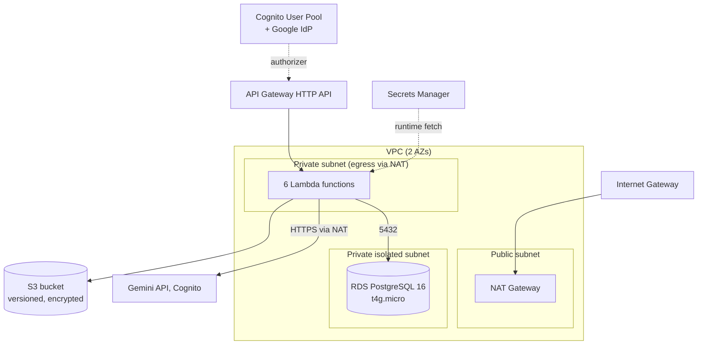
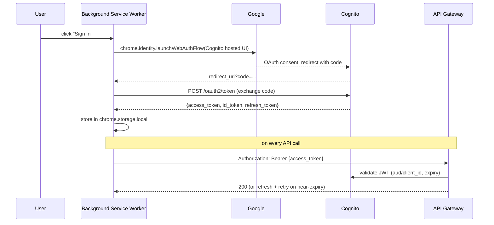

# Architecture

Deep-dive reference for how NoteSnap is built. For a quick orientation, see the [root README](../README.md); for original design intent, see [AWS-ARCHITECTURE-SPEC.md](AWS-ARCHITECTURE-SPEC.md), [MVP-SPEC.md](MVP-SPEC.md), and [ACCOUNTS-AND-STORAGE-SPEC.md](ACCOUNTS-AND-STORAGE-SPEC.md).

## Contents

- [AWS infrastructure](#aws-infrastructure)
- [Data model](#data-model)
- [API contracts](#api-contracts)
- [Async note generation](#async-note-generation)
- [Auth flow](#auth-flow)
- [Extension architecture](#extension-architecture)
- [Local-first sync](#local-first-sync)
- [Key engineering decisions](#key-engineering-decisions)
- [GDPR posture](#gdpr-posture)

## AWS infrastructure

Single CDK stack (`infra/lib/infra-stack.ts`), deployed to **eu-west-1** (EU data residency for GDPR).



**Networking**: 3-tier VPC — public (NAT only), private-with-egress (Lambdas), private-isolated (RDS, no internet route at all). RDS is never reachable from outside the VPC; the schema migration itself runs as a Lambda-backed CloudFormation Custom Resource so nobody needs direct DB access to apply `schema.sql`.

**Compute**: 6 Node.js 22 Lambda functions behind one API Gateway HTTP API, one shared VPC security group, 512MB / 90s timeout for the CRUD functions (15-30s in practice), same for generation (see [Async note generation](#async-note-generation) for why 90s doesn't fight API Gateway's own ceiling).

**Storage**: RDS Postgres holds only note *metadata* (title, timestamps, status, `s3_key` pointer) — the actual generated content (all 8 modes, full JSON) lives in S3, versioned and encrypted, keyed by an opaque UUID. This keeps the hot metadata table small regardless of note volume or content size.

**Auth**: Cognito User Pool, Google-only federation (no self-signup, no password), public app client (no secret — appropriate for a Chrome extension using `chrome.identity.launchWebAuthFlow`), API Gateway's `HttpJwtAuthorizer` validates every route.

**Secrets**: Gemini API key, Google OAuth client secret, and RDS credentials all live in Secrets Manager. They are **never** written into CDK source or Lambda environment variables directly — see [Key engineering decisions](#key-engineering-decisions) for why environment-variable dynamic references don't work here, and how each Lambda fetches its secret at runtime instead.

## Data model

### `notes` table (RDS Postgres)

```sql
notes (
  id            uuid primary key,
  user_id       uuid not null,        -- Cognito 'sub' claim, not a duplicated PII field
  video_id      text not null,
  video_title   text,                 -- null while status = 'generating'
  video_channel text,
  video_url     text not null,
  duration_s    integer,              -- null while status = 'generating'
  s3_key        text,                 -- null until status = 'ready'
  edited        boolean not null default false,
  status        text not null default 'generating' check (status in ('generating','ready','failed')),
  error_message text,
  created_at    timestamptz not null default now(),
  updated_at    timestamptz not null default now(),
  unique (user_id, video_id)
)
```

`unique(user_id, video_id)` means **one note per user per video** — regenerating overwrites the existing row (`on conflict ... do update ... edited = false`). This is a deliberate simplicity trade-off, but it means the client must warn before regenerating a note that's already been edited, since regeneration silently discards those edits server-side.

### Note content (S3 JSON, one object per note)

```typescript
interface NoteContent {
  video: { title, channel, duration_s, url };
  summary: { overview, takeaways: TimestampedItem[] };
  sections: Section[];              // Lecture Notes / Outline source data
  cheatsheet: { key_terms, formulas, core_concepts, exam_traps };
  flashcards: Flashcard[];
  practice_questions: PracticeQuestion[];  // mcq | short_answer
}
```

Every leaf item that references a moment in the video carries an optional `t_s` (or `start_s`/`end_s` for ranges). **Optional is load-bearing**: `generate-notes.ts`'s `clampTimestamps()` deletes any timestamp outside `[0, duration_s]` rather than dropping the whole item, so a leaf can legitimately arrive with no timestamp — every renderer must treat a missing `t_s` as plain text, not an error.

The extension's TypeScript types in `extension/src/types/note-content.ts` are a **hand-duplicated mirror** of this shape, not a shared package — see [Key engineering decisions](#key-engineering-decisions).

## API contracts

All routes behind `https://{api-id}.execute-api.eu-west-1.amazonaws.com`, Cognito JWT authorizer on every route (send the **access token**, not the ID token — see [Auth flow](#auth-flow)).

| Route | Method | Body | Success | Notes |
|---|---|---|---|---|
| `/notes/generate` | POST | `{ video_url }` | `202 { note_id, status: "generating" }` | Async — poll `GET /notes/{id}` |
| `/notes` | GET | — | `200 { notes: NoteMetadata[] }` | Metadata only, no `content` |
| `/notes/{id}` | GET | — | `200 { ...metadata, content }` | `content: null` while generating/failed |
| `/notes/{id}` | PUT | bare `NoteContent` object (not wrapped) | `200 { note_id, edited: true }` | |
| `/notes/{id}` | DELETE | — | `204` empty body | |
| `/account` | DELETE | — | `200 { deleted: true }` | GDPR erasure — see below |

## Async note generation

API Gateway HTTP APIs hard-cap Lambda integration timeout at **29 seconds** (confirmed by reading `aws-cdk-lib`'s own construct validation source, which throws before synth if you try to configure higher — this is a CDK-enforced ceiling, independent of any account-level AWS quota). A full 8-mode Gemini generation regularly takes 34–51 seconds.

`generate-notes.ts` is split into a synchronous handler and an async worker:

1. Sync handler: writes a `status='generating'` row, self-invokes itself asynchronously (`InvocationType: 'Event'`), returns `202` immediately.
2. Async worker (same Lambda, different invocation): calls Gemini, clamps timestamps, writes the result to S3, flips the row to `status='ready'` (or `'failed'` with `error_message` on any error — the worker never throws past its own boundary).
3. Extension polls `GET /notes/{id}` every 3 seconds, up to a 120-second deadline.

The self-invoke IAM permission is a **standalone `iam.Policy`**, not folded into the function's default role policy — `grantInvoke(self)` and `addToRolePolicy()` both produce a CloudFormation circular-dependency error here, because the function's default policy resource is already in the dependency chain of other resources (the API Gateway integration, log group) that also depend on the function existing first.

## Auth flow



`chrome.identity` is only available in extension pages (background, options) — **not** content scripts, where the sidebar actually runs. Every auth operation is a `chrome.runtime.sendMessage` from the content script to the background service worker, which owns the real `chrome.identity` + token logic (`extension/src/background/auth-handler.ts`). Tokens refresh proactively 5 minutes before expiry.

The extension sends the **access token**, not the ID token, on every API call — OAuth-conventional (access tokens authorize API access; ID tokens identify the user to the client), and confirmed against the deployed `HttpJwtAuthorizer` config, which checks `aud` first and falls back to `client_id` — Cognito access tokens carry `client_id` but not `aud`.

## Extension architecture

```
content-script.ts  →  mount.ts (Shadow DOM host + React root)  →  SidebarApp.tsx
```

- **Shadow DOM isolation**: the sidebar mounts inside an `open` Shadow root injected into the YouTube watch page, so neither YouTube's styles nor the sidebar's own CSS ever bleed across the boundary.
- **SPA-navigation aware**: YouTube is a single-page app — clicking a related video never triggers a full page reload, so `content-script.ts` only mounts the sidebar once per page load. `SidebarApp.tsx` separately listens for YouTube's own `yt-navigate-finish` event (with a fallback poll) and resets/reloads its state for whichever video is now active. Without this, the sidebar would keep showing the previous video's notes indefinitely.
- **State**: two Zustand stores — `note-store` (current note's generation status, content, dirty flag, expanded/collapsed UI state) and `auth-store` (signed-in/out/checking).
- **Mode renderers**: one component per study mode in `sidebar/modes/`, each rendering its slice of `NoteContent`, wiring every timestamp through the shared `TimestampChip` component, and wiring edits through `EditableText` into the store's mutation actions. `MindMapView` is the outlier — hierarchical SVG layout instead of a text renderer, and its PDF export is a canvas snapshot rather than a `jsPDF` text layout like the other 7 modes.
- **PDF export**: `lib/pdf/` has one layout file per mode, dispatched from `lib/pdf/index.ts`.

## Local-first sync

Editing a note (via `EditableText`) never waits on the network:

1. The edit applies to the in-memory Zustand store immediately and sets a `dirty` flag.
2. A `useEffect` writes the updated content to `chrome.storage.local` synchronously (feels instant).
3. A **debounced** push (`lib/sync.ts`) sends the same content to `PUT /notes/{id}` after a short quiet period, so rapid consecutive edits don't spam the API.
4. On load (including after SPA navigation to a previously-visited video), a **pull-on-load** check compares the local cache against the server before trusting it — guards against an older local copy silently winning over a newer server-synced copy from another device/session.

`SyncIndicator` in the sidebar footer reflects one of: synced, syncing, offline (queued), or dirty (unsaved).

## Key engineering decisions

A few non-obvious choices worth knowing before touching this code:

- **Secrets via runtime SDK fetch, not environment-variable dynamic references.** CloudFormation's `{{resolve:secretsmanager:...}}` dynamic references are *not* supported for Lambda environment variables (only certain resource properties, like RDS `MasterUserPassword`, support them) — an environment variable configured this way silently resolves to garbage rather than erroring. `generate-notes.ts` instead receives only the secret's ARN via environment variable and fetches the actual value from Secrets Manager at cold-start/runtime via the SDK.
- **Cognito email must be mutable.** An IdP-federated attribute (Google email) has to be `mutable: true` on the User Pool — Cognito re-syncs mapped attributes from the IdP on every login, and an immutable email attribute makes every *second* sign-in fail with `Attribute cannot be updated`. Mutability can't be changed on an existing pool, only at creation time, which is why the pool is `NoteSnapUserPoolV2` (a deliberate replacement, not an in-place fix).
- **Types are hand-duplicated between `infra/` and `extension/`, not a shared package.** The Lambda side has no canonical typed/validated schema today (structural `any`-typed clamping only) — a shared workspace package would be real build/tooling overhead across two different runtimes for a contract that, if it drifts, fails loudly (a renderer visibly breaks) rather than silently. Revisit only if a second consumer of the schema appears.
- **Client-only `uid` field.** Every leaf array item gets a stable, client-assigned `uid` (via `storage.ts`'s `normalizeNoteContent()`) the first time content is loaded, preserved through edits. It doesn't exist in the server schema — it exists purely so React keys and the edit/delete UI have something stable to reference, and is not meaningful if sent back to the server (harmless if it is; the server ignores unknown fields).
- **`mediaResolution: 'MEDIA_RESOLUTION_LOW'`**, not `'low'` — Gemini's video-understanding API parameter is case- and format-sensitive; the lowercase short form silently fails to apply.

## GDPR posture

Baked into the infrastructure, not bolted on:

- All storage (S3, RDS) encrypted at rest, EU-resident (eu-west-1).
- RDS stores minimal PII — a Cognito `sub` (opaque UUID) and video metadata, never a duplicated copy of email/name from Cognito.
- S3 object keys use opaque note/user UUIDs, not personal identifiers.
- **Right to erasure (Article 17)** is a first-class Lambda (`delete-account.ts`), not an afterthought: `DELETE /account` removes the user's RDS rows, their S3 objects, and calls `cognito-idp:AdminDeleteUser` to remove the Cognito identity itself, in one request.
